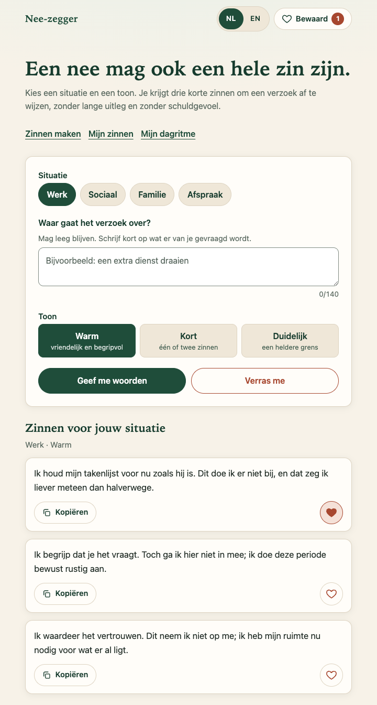
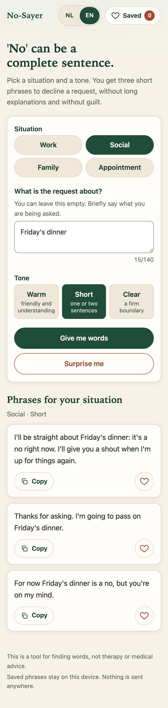

# Grens · Nee-zegger Script Generator

**Live:** [philip-wintrip.com/grens](https://philip-wintrip.com/grens) · Nederlands en English

Een rustige, vriendelijke webapp die korte zinnen geeft om appjes, verzoeken of afspraken af te wijzen, zonder uitgebreide uitleg en zonder schuldgevoel. Voor mensen met een burn-out, overprikkeling of gewoon behoefte aan rust.

*Een nee mag ook een hele zin zijn.*



[English version below](#grens--no-sayer-script-generator-english)

## Wat doet het?

1. Kies een **situatie**: Werk, Sociaal, Familie of Afspraak.
2. Typ eventueel kort **waar het verzoek over gaat** (max. 140 tekens). Mag ook leeg blijven.
3. Kies een **toon**: Warm, Kort of Duidelijk.
4. Druk op **Geef me woorden**. Je krijgt drie verschillende zinnen, met jouw tekst er natuurlijk in verwerkt.
5. **Kopieer** een zin naar je klembord, of **bewaar** hem met het hartje. Bewaarde zinnen blijven staan, ook na herladen.
6. Geen zin om te kiezen? **Verras me** kiest een situatie, een toon én een voorbeeldverzoek, en geeft meteen drie zinnen.

De taalkeuze (NL/EN) staat rechtsboven. Nederlands is de standaard; de keuze wordt onthouden.

## Kenmerken

- Alleen HTML, CSS en JavaScript. Geen backend, geen build-stap, geen externe bibliotheken of lettertypen.
- Werkt direct door `index.html` te openen, ook offline.
- 72 zinnen per taal (4 situaties × 3 tonen × 6), elk in een algemene vorm en een vorm met jouw tekst erin.
- Toegankelijk: echte formulierelementen, labels, zichtbare focus, voldoende contrast, meldingen voor schermlezers, ondersteuning voor verminderde beweging en hoog contrast.
- Mobile-first en bruikbaar vanaf 320 px breed.
- Privacy: bewaarde zinnen en de taalkeuze staan alleen in de `localStorage` van je browser. Er wordt niets verstuurd.

## Mijn zinnen en Mijn dagritme

**Mijn zinnen** is een aparte verzameling eigen teksten (maximaal 500 tekens), met categorie, toon en een optioneel favoriet-vinkje. Je kunt toevoegen, bewerken, verwijderen, kopiëren en zoeken; filters voor categorie, toon en favorieten werken samen. De bestaande gegenereerde zinnen blijven onder **Bewaard**. Je eigen tekst wordt niet vertaald wanneer je de interface op EN zet.

**Mijn dagritme** bevat terugkerende momenten met een tijd, titel (maximaal 100 tekens), tekst of gekoppelde eigen zin, weekdagen en actief-vinkje. Bij het eerste gebruik staan drie aanpasbare voorbeelden klaar: 08:00 ochtend, 12:00 middag en 20:00 avond, op alle dagen. Een bewust leeggemaakt ritme blijft leeg na herladen.

Het dagoverzicht toont alleen actieve momenten op de gekozen weekdag, op tijd gesorteerd. Afvinken wordt per lokale kalenderdatum bewaard. Onder ‘Alle terugkerende momenten’ kun je ook inactieve momenten en momenten op andere dagen bewerken. Een gekoppelde zin verandert mee bij bewerken; na verwijderen blijft de laatste tekst in het moment staan. Voorbeeldmomenten wisselen mee van taal totdat je ze zelf bewerkt.

## Lokale opslag en back-ups

| Key | Inhoud |
| --- | --- |
| `neezegger.saved.v1` | Bestaande gegenereerde bewaarde zinnen; ongewijzigd formaat |
| `neezegger.lang.v1` | Bestaande NL/EN-voorkeur |
| `neezegger.custom.v1` | Eigen zinnen |
| `neezegger.schedule.v1` | Terugkerende momenten |
| `neezegger.daily-log.v1` | Afgevinkte moment-ID's per lokale datum |

De drie nieuwe keys gebruiken `{ "version": 1, "items": ... }`. Ze overschrijven of migreren de twee bestaande keys niet. Onleesbare of onbekende versies blijven intact en krijgen een melding. Een opslagfout wordt gemeld; de app doet dan niet alsof de wijziging is opgeslagen. Een wijziging vanuit een ander tabblad blokkeert het overschrijven van verouderde gegevens: kopieer onopgeslagen invoer en herlaad.

**JSON exporteren/importeren** staat onder ‘Een kopie voor jezelf’. Het exportformaat is `{ "app": "Grens", "version": 1, "custom": [...], "schedule": [...] }`. Alleen eigen zinnen en ritme worden geëxporteerd; bestaande gegenereerde favorieten, taalvoorkeur en afvinkhistorie blijven lokaal. Een export bevat persoonlijke tekst: bewaar het bestand op een plek die je zelf kiest.

Import controleert het volledige bestand vóór het opslaan: versie, types, tekstlengtes, tijd, dagen, IDs en verwijzingen. Onjuiste bestanden worden volledig geweigerd. Geldige items worden toegevoegd; inhoudelijke duplicaten worden samengevoegd. Bestaande IDs en actief-status blijven bij duplicaten behouden, favorieten blijven aangevinkt. Conflicterende IDs van nieuwe items worden vervangen en koppelingen worden aangepast. Een ontbrekende gekoppelde zin valt terug op de tekst in het moment.

Limieten: 1 MiB per JSON-bestand en 1000 eigen zinnen / 1000 momenten, ook na samenvoegen. Een te grote export geeft een fout en laat de gegevens staan. Schrijven van meerdere keys wordt vooraf gevalideerd en bij fouten teruggedraaid; `localStorage` biedt geen echte transacties. Als ook terugdraaien mislukt, vraagt de app om herladen en controle.

Opslag is gebonden aan apparaat, browser en website-adres. Wisselen van browser/adres of wissen van browsergegevens neemt de data niet automatisch mee; maak eerst een export. De app werkt zonder internet als je de bestanden lokaal bewaart en `index.html` opent. De gehoste website heeft geen service worker: opnieuw openen/herladen zonder netwerk is daar niet gegarandeerd. Er zijn geen accounts, analytics, externe API's of notificatieverzoeken. Agenda-export en meldingen bij een gesloten site zijn niet toegevoegd.

## Zelf draaien

Dubbelklik op `index.html`, of start een lokale server:

```bash
cd Grens
python3 -m http.server 8000
```

Open daarna `http://localhost:8000`.

## Bestanden

| Bestand | Inhoud |
| --- | --- |
| `index.html` | Structuur van de pagina |
| `styles.css` | Vormgeving (crème, donkergroen, terracotta, zachte groentinten) |
| `main.js` | Bestaande generator en taalwissel; taal-event voor de uitbreiding |
| `personal.js` | Eigen zinnen, dagritme, formulieren, NL/EN en import/export |
| `storage.js` | Versiecontrole, validatie, lokale opslag en samenvoegen van back-ups |
| `tests/` | Opslagtests en browseracceptatietests zonder pakketten |
| `phrases.js` | Zinnenbank en voorbeeldverzoeken in het Nederlands en Engels |
| `docs/` | Schermafbeeldingen voor deze README |

Zinnen toevoegen of aanpassen doe je in `phrases.js`. Elke zin heeft een `generic`-variant (voor een leeg veld) en een `topic`-variant met `{x}` op de plek waar de tekst van de gebruiker komt.

## Controleren

Er is geen buildproces of package-installatie nodig. Met Node.js 22 of nieuwer:

```bash
node --test tests/storage.test.cjs
node tests/browser.mjs
```

De browsertest gebruikt een geïsoleerd tijdelijk Chrome-profiel. Op macOS wordt de gebruikelijke Chrome-locatie gebruikt; stel elders `CHROME_BIN` in op je Chrome/Chromium-programma. De test gebruikt Node's ingebouwde WebSocket. Resultaten en schermafbeeldingen staan in de tijdelijke map `grens-qa` (aanpasbaar met `GRENS_QA_DIR`). Zie `tests/RESULTS.md` voor de uitgevoerde controles en hun grenzen.

## Op de website zetten

Upload `index.html`, `styles.css`, `phrases.js`, `main.js`, `storage.js` en `personal.js` naar de map `grens` van de webruimte, zodat `index.html` op `https://philip-wintrip.com/grens/index.html` staat. Meer is niet nodig.

## Goed om te weten

Deze tool is een hulpmiddel om woorden te vinden, geen therapie of medisch advies.

---

# Grens · No-Sayer Script Generator (English)

**Live:** [philip-wintrip.com/grens](https://philip-wintrip.com/grens) · Dutch and English

A calm, friendly web app that gives you short phrases to decline messages, requests or appointments, without long explanations and without guilt. For people dealing with burnout, overstimulation, or who simply need some rest.

*'No' can be a complete sentence.*



## What it does

1. Pick a **situation**: Work, Social, Family or Appointment.
2. Optionally type **what the request is about** (max. 140 characters). You can leave it empty.
3. Pick a **tone**: Warm, Short or Clear.
4. Press **Give me words**. You get three different phrases, with your text woven in naturally.
5. **Copy** a phrase to your clipboard, or **save** it with the heart. Saved phrases survive a reload.
6. Can't decide? **Surprise me** picks a situation, a tone and an example request, and gives you three phrases straight away.

The language switch (NL/EN) is in the top right. Dutch is the default; your choice is remembered.

## Features

- Plain HTML, CSS and JavaScript. No backend, no build step, no external libraries or fonts.
- Works by simply opening `index.html`, also offline.
- 72 phrases per language (4 situations × 3 tones × 6), each in a generic form and a form with your text inserted.
- Accessible: real form controls, labels, visible focus, sufficient contrast, screen-reader announcements, support for reduced motion and high contrast.
- Mobile-first and usable from 320 px wide.
- Privacy: saved phrases and the language choice live only in your browser's `localStorage`. Nothing is sent anywhere.

## My phrases and My daily rhythm

**My phrases** keeps personal text separate from generated **Saved** phrases. Add, edit, delete or copy a phrase (up to 500 characters), choose its category and tone, and mark favourites. Search and category/tone/favourite filters combine. Personal writing stays in its original language when you switch the interface.

**My daily rhythm** has recurring moments with a time, title (up to 100 characters), text or linked phrase, weekdays and active status. Three editable examples appear on first use at 08:00, 12:00 and 20:00, every day. Deleting all moments leaves the schedule empty after reload. Unedited examples follow the interface language.

The date picker shows active moments for that weekday, sorted by time. Completion is stored by local calendar date. ‘All recurring moments’ also lets you edit inactive moments or those on other days. Linked phrases update with their source; deleting the phrase keeps its latest text in the moment.

## Storage and backups

The existing `neezegger.saved.v1` and `neezegger.lang.v1` keys retain their format. New keys `neezegger.custom.v1`, `neezegger.schedule.v1` and `neezegger.daily-log.v1` use `{ "version": 1, "items": ... }`. Invalid or future data is protected from overwriting. Failed saves and changes from another browser tab are reported; copy unsaved input and reload if there is a conflict.

Export/import uses `{ "app": "Grens", "version": 1, "custom": [...], "schedule": [...] }`. It includes personal phrases and recurring moments, excluding saved generated phrases, language and completion history. Imports validate the entire file before merging. Invalid files are rejected; valid entries are added without content duplicates. Existing IDs and enabled status are preserved for duplicates, favourites are combined, and conflicting IDs are replaced with phrase links remapped. Missing phrase links retain their text snapshot.

Limits: 1 MiB per JSON backup and 1000 phrases / 1000 moments, including after merging. Oversized exports fail without altering data. Multi-key writes attempt rollback on failure; localStorage cannot provide true transactions, so an interrupted rollback is explicitly reported.

Data belongs to this device, browser and website address. Export before switching browsers or clearing storage. Local downloaded files work offline; the hosted page has no service worker, so offline navigation/reload is not guaranteed. No accounts, analytics, external APIs or notification permissions are added. Calendar export and closed-site notifications are outside this version.

## Run it locally

Double-click `index.html`, or start a local server:

```bash
cd Grens
python3 -m http.server 8000
```

Then open `http://localhost:8000`.

## Files

| File | Contents |
| --- | --- |
| `index.html` | Page structure |
| `styles.css` | Styling (cream, dark green, terracotta, soft greens) |
| `main.js` | Existing generator and language-change event |
| `personal.js` | Personal phrases, daily rhythm, forms, NL/EN and backup UI |
| `storage.js` | Versioning, validation, storage and backup merging |
| `tests/` | Dependency-free storage and browser acceptance tests |
| `phrases.js` | Phrase bank and example requests in Dutch and English |
| `docs/` | Screenshots for this README |

To add or change phrases, edit `phrases.js`. Each phrase has a `generic` variant (for an empty field) and a `topic` variant with `{x}` where the user's text goes.

## Checking changes

With Node.js 22 or later, run `node --test tests/storage.test.cjs` and `node tests/browser.mjs`. The browser test launches an isolated temporary Chrome profile. Set `CHROME_BIN` if Chrome is outside the default macOS location. Reports and screenshots go to the temporary `grens-qa` folder, configurable through `GRENS_QA_DIR`. See `tests/RESULTS.md` for the checks performed and their limits.

## Putting it on the website

Upload `index.html`, `styles.css`, `phrases.js`, `main.js`, `storage.js` and `personal.js` into the `grens` folder on the web host, so that `index.html` ends up at `https://philip-wintrip.com/grens/index.html`. Nothing else is needed.

## Good to know

This is a tool for finding words, not therapy or medical advice.
